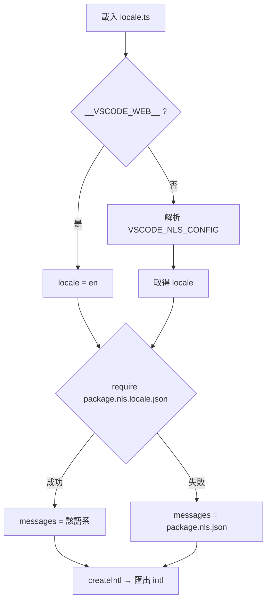
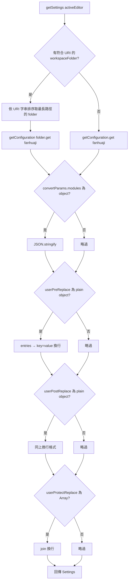
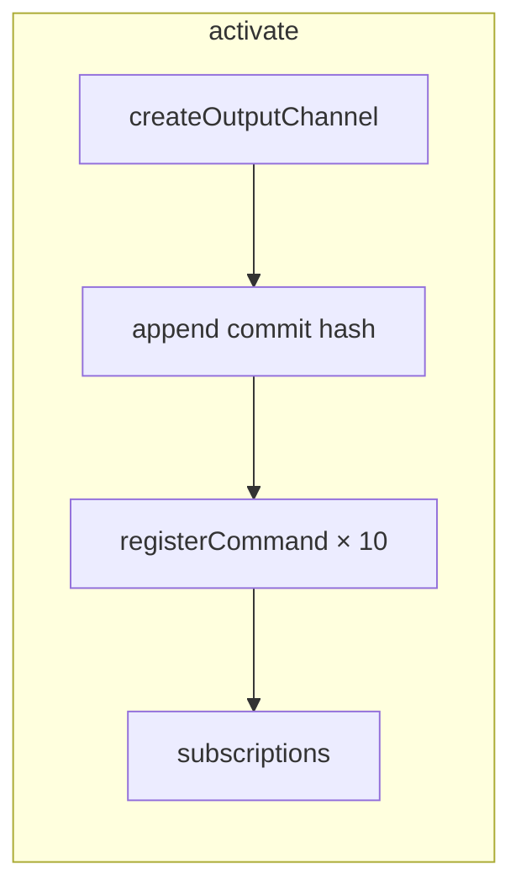
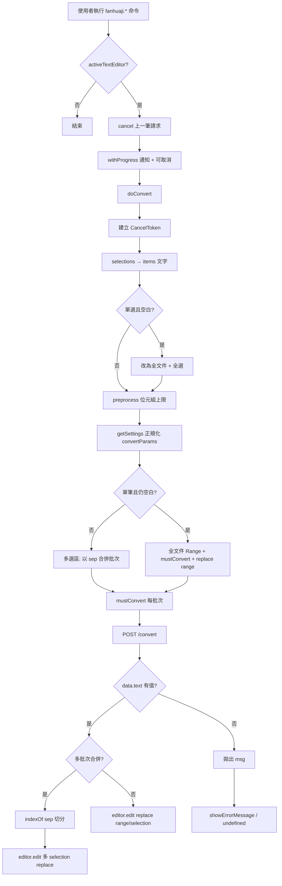
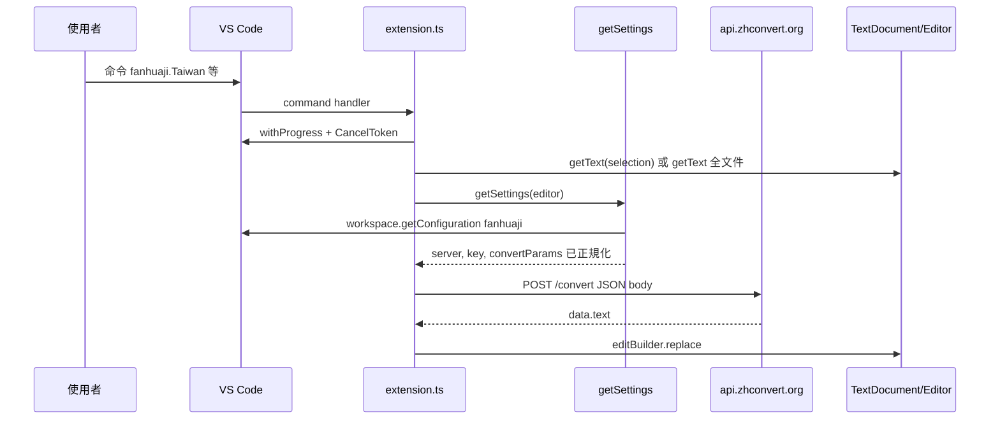
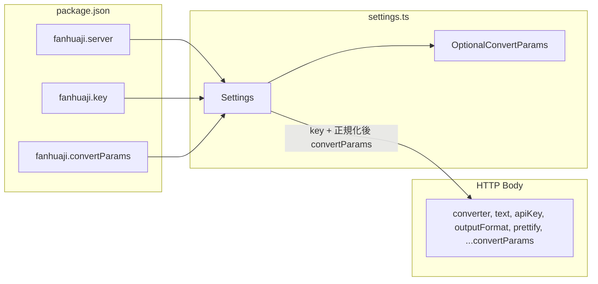

# vscode-fanhuaji 擴充功能設計文件

本文件描述 `src/locale.ts`、`src/settings.ts`、`src/extension.ts` 的職責、資料流與執行流程，並以 Mermaid 圖表呈現設定載入、外部 API、編輯器取代等完整路徑。

---

## 1. 模組職責

| 模組 | 職責 |
|------|------|
| `locale.ts` | 依 VS Code 的 NLS 環境載入 `package.nls.{locale}.json`，建立 `@formatjs/intl` 的 `intl` 實例，供 UI 字串格式化。 |
| `settings.ts` | 定義擴充功能設定形狀：`Settings`（`server`、`key`、`convertParams`）與 `OptionalConvertParams`（轉換 API 可選參數型別）。 |
| `extension.ts` | 註冊命令、讀取設定並正規化、呼叫繁化 API、將結果寫回編輯器。 |

---

## 2. 國際化（locale）初始化

模組載入時即執行 `init()`（非在 `activate` 內）。

- **Web 版**：強制 `locale: "en"`。
- **桌面版**：解析 `process.env.VSCODE_NLS_CONFIG` 的 JSON，取得 `locale`（文件假設為 `en` 或 `zh-tw`）。
- 嘗試 `require('../package.nls.${locale}.json')`，失敗則退回 `package.nls.json`。
- 匯出單例 `intl`，供 `extension.ts` 使用（例如進度通知標題 `intl.formatMessage({ id: "ext.running" })`）。

---

## 3. 設定來源與正規化（getSettings）

### 3.1 設定區段

VS Code 設定鍵前綴為 `fanhuaji`（見 `package.json` 的 `contributes.configuration`），與程式中 `getConfiguration("").get("fanhuaji")` 對應。

### 3.2 工作區優先順序

1. 若有「目前使用中編輯器」且其文件 URI 落在某個 `workspaceFolder` 之下，則對**該資料夾路徑最長（字串排序後取前者）**的那個 folder 呼叫 `getConfiguration("", ws[0])`，讀取 `fanhuaji`。
2. 否則使用使用者／工作區層級的 `getConfiguration("").get("fanhuaji")`。

### 3.3 convertParams 正規化（寫入請求前）

| 欄位 | 若型別為 | 轉成 |
|------|----------|------|
| `modules` | `object` | `JSON.stringify(modules)` |
| `userPreReplace` | 非 null 的 plain object（非 array） | `key=value` 每行一組，以 `\n` 連接 |
| `userPostReplace` | 同上 | 同上 |
| `userProtectReplace` | `Array` | `array.join("\n")` |

其餘欄位維持原樣，一併透過 `...params` 併入 API 請求本文。

---

## 4. 擴充功能啟動（activate）

- 建立輸出通道 `NAME`（`Fanhuaji`），寫入建置時的 `__COMMIT_HASH__`。
- 為每種轉換器註冊一個命令：`fanhuaji.Traditional`、`fanhuaji.Simplified`、…、`fanhuaji.WikiTraditional`。
- 命令處理器皆為 `command(converter)` 回傳的非同步函式（見下一節）。

---

## 5. 使用者觸發命令後的完整流程

### 5.1 高階步驟

1. 若無作用中編輯器則結束。
2. 取消上一筆尚未完成的請求（`cancel?.()`）。
3. `withProgress` 顯示可取消通知，標題使用 `intl`。
4. `doConvert(editor)`：建立新的 Axios `CancelToken`，供本次 API 使用。

### 5.2 選取範圍與預處理

- 由 `editor.selections` 取得多個選區文字；若**僅一個選區且為空**，改為整份文件與全文件 `Selection`。
- **preprocess**：以 `TextEncoder` 計算 UTF-8 位元組長度，超過 `MAX_TEXT_LENGTH_IN_BYTES`（5_000_000）的區塊顯示錯誤並自清單剔除。

### 5.3 單一有效區塊（整文件或單一非空選區且 preprocess 後仍為一筆）

- 若該筆文字仍為空（邊界情況）：再次取全文件，以 `Range` 全範圍取代。
- 否則進入**多選區合併**流程。

### 5.4 多選區合併與回寫

- 分隔字串：`" 𫠬𫠣 "`（固定字串，用於在單次 API 回應中切回各選區）。
- 將選區依序併入批次物件 `o`，若加上分隔後長度將超過上限則先 `list.push(o)` 再開新批次。
- 每批次：`texts.join(sep)` → `mustConvert` → 以 `indexOf(sep)` 切分結果 → `editor.edit` 內對各 `selection` 做 `replace`。

### 5.5 mustConvert → convert → HTTP

- `mustConvert`：空字串直接回傳 `""`；否則呼叫 `convert`。
- `convert`：`POST {base}/convert`，本文為 `RequestOptions`（`converter`、`text`、`apiKey`、`outputFormat: "json"`、`prettify: false` 與展開後的 `convertParams`）。
- 若回應 `data.data.text` 為 `undefined`，丟出 `resp.data.msg`。
- 錯誤：`axios.isCancel` 回 `undefined`；Axios 錯誤或其它有 `message`／字串錯誤則 `showErrorMessage`。

**實作備註**：`convert` 內部的 `request(options, settings?)` 目前呼叫時未傳入第二參數，因此 POST 基底網址實際恒為 `https://api.zhconvert.org`（`settings?.server` 在該路徑下不會生效）。若未來要支援自訂 `fanhuaji.server`，需將 `getSettings` 取得的 `server` 傳入 `request`。

---

## 6. 外部呼叫與內部取代的對應關係

---

## 7. 資料結構關係（設定 → 請求本文）

---

## 8. deactivate

目前為空實作，無需釋放額外資源（訂閱已由 `context.subscriptions` 管理）。

---

## 9. 相關常數與型別索引

- **位元組上限**：`MAX_TEXT_LENGTH_IN_BYTES = 5000000`
- **轉換器列舉**：`Traditional`、`Simplified`、`Taiwan`、`China`、`Hongkong`、`Pinyin`、`Bopomofo`、`Mars`、`WikiSimplified`、`WikiTraditional`
- **回應形狀**：`ResponseData`（含 `data.text`、`code`、`msg`、`execTime` 等）

以上與原始碼同步時，請一併更新本文件與圖表。
